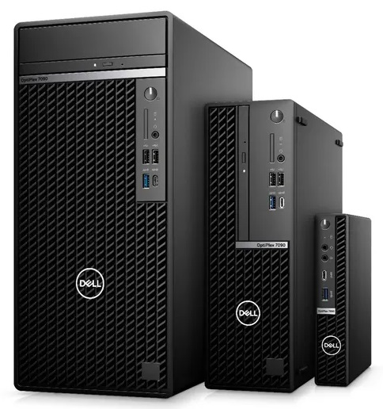
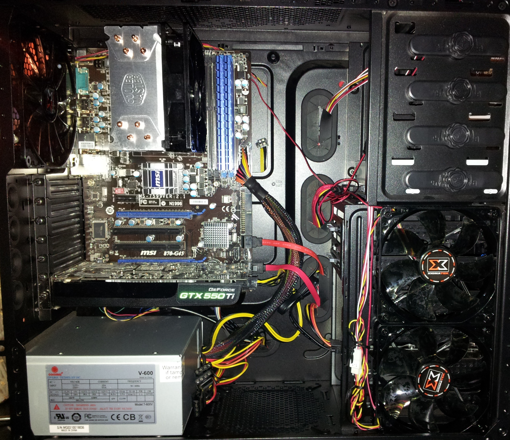
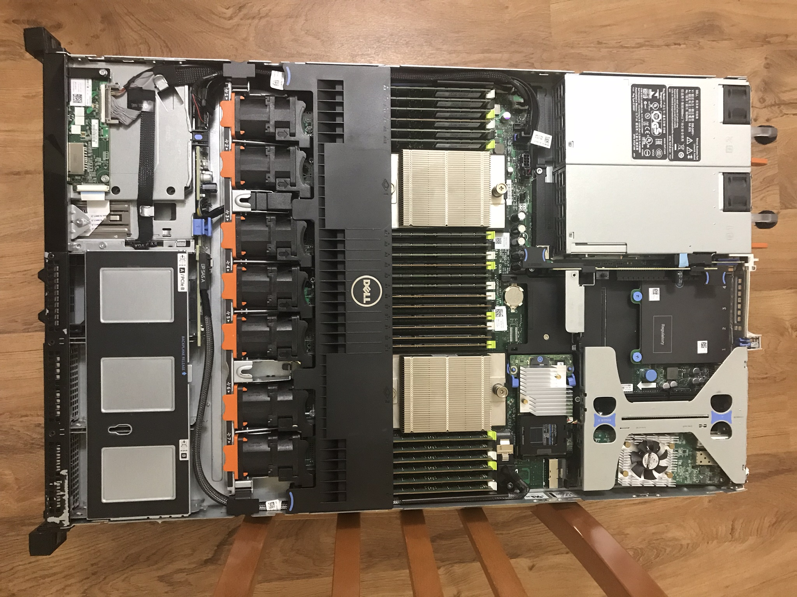

This page will give examples and ideas for homelab hardware. It starts basic and works its way up to hopefully give a good spread of options for everyone.

## Starting out

This section outlines some options that require little or no financial investment, perfect for just starting out!

### Windows + WSL

Assuming that most people have a Windows machine, one of the quickest ways to start playing with things is WSL. This allows you to run a lightweight Linux VM on your Windows box with minimal effort.

I would recommend following the [Microsoft docs](https://learn.microsoft.com/en-us/windows/wsl/install) to get situated. By default, a recent version of Ubuntu will be installed. If you'd like to change what distribution gets installed, check out this [page](https://learn.microsoft.com/en-us/windows/wsl/basic-commands#list-available-linux-distributions).

Once configured, you'll now have access to a Linux VM to play around with!

One additonal thing I'd recommend adding would be Docker Desktop. Follow the instructions [here](https://docs.docker.com/desktop/install/windows-install/). This has good integrations with WSL so you can do all the container things you desire. You might be able to do containers on the Windows side as well but I've never experimented with that so no guarantees.

### Older devices

Any older computers/laptops can see new life in your homelab. Windows may not run super well on dated hardware, however Linux is happy on even the most constrained hardware. The best part is you don't even need additional peripherals. Once Linux is installed, power and network connectivity are all you need thanks to the power of SSH!

The steps here are pretty simple:

1. Determine which Linux distro you'll be using and download the .iso
    - If you're unsure or have no idea, [Ubuntu](https://ubuntu.com/download) is a solid choice.
    - I would recommend "Server" .iso's since you really don't need the overhead of a GUI.

1. "Burn" the .iso to a flash drive
    - I would recommend using the portable version of [Rufus](https://rufus.ie/en/), since it doesn't require installing.
    - [Etcher](https://etcher.balena.io/) is commonly recommended but tends to leave the flash drive in a state that makes it hard to work with once you're done; I would avoid it.

1. Plug in the flash drive, boot from it, and run through the installer

You now have a capable Linux box!

### "We have Kubernetes at home"

If you're looking to experiment with [Kubernetes](https://kubernetes.io/) but don't have the hardware to set up physical nodes, there's some neat alternatives! These allow you to create a cluster on a single device, perfect for toying around with.

This isn't an all-encompassing list and it's up to you to research and decide which may work best for you. 

- [k3d](https://k3d.io/)
- [minikube](https://minikube.sigs.k8s.io/)
- [kind](https://github.com/kubernetes-sigs/kind)

## Stepping it up

This section outlines some purchasing options for that will deliver great value, providing dedicated hardware for your homelab. Typical options here will be used equipment that still have life left.

### Mini PCs - Dell & HP

There's a ton of used mini PCs all over online marketplaces, with HP and Dell being popular OEMs. These devices provide a significant value since they're pretty potent for their form factor and can be obtained cheaply compared to new devices. 

The ServeTheHome forum has an ongoing [TinyMiniMicro](https://www.servethehome.com/introducing-project-tinyminimicro-home-lab-revolution/) project where various options are tested and reviewed. This project, and the forums in general, are a great resource for these devices. They also have a handy [reference thread](https://forums.servethehome.com/index.php?threads/lenovo-thinkcentre-thinkstation-tiny-project-tinyminimicro-reference-thread.34925/) for HP Tiny machines!

I'm more in-the-loop on Dell devices so I can provide some information about them specifically below:

- Dell Optiplex comes in 3 typical sizes:
    - Tower
    - Small Form Factor (SFF)
    - Micro Form Factor (MFF)

- The MFF devices are my personal favorite as they only have a 7"H x 7"W ~1.5"D footprint.

- The model numbers can be confusing at first, but they follow a pretty predictable format:
    
    - First digit = features. Bigger numbers typically have some additional hardware options, different chipset/ports, etc.
        - 3xxx
        - 5xxx
        - 7xxx
    
    - Third digit = generation. These signify essentially how old the model is, resulting in different CPUs.
        - xx5x
        - xx6x
        - xx7x
        - xx8x
        - xx9x (current)

- A great resource for obtaining these devices is [Dell Refurbished](https://www.dellrefurbished.com/). These come refurbished from Dell (the one I received looked brand new) and come with a power supply, keyboard, and mouse.
    - They constantly have coupons for 40-50% off plus free shipping; check the `Coupons` section frequently for deals.
    - Some other coupons can be found just browsing around the different categories so keep your eyes open!

### Mini PCs - Others

There's also other mini PC options out there. Various manufacturers have their hat in the ring with an assortment of offerings:

- Intel NUC
    - These were discontinued by Intel and transitioned to Asus
    - You can also find used/older models
- [Minisforum](https://www.minisforum.com/)
- [Beelink](https://www.bee-link.com/)
- Probably others

### Building PCs

An alternative avenue is building exactly the computer(s) you want/need. Mind you, this isn't your typical gaming PC, so things will be a little different.

I won't go into detail for every component but I will give some information for key components. The rest is up to your discretion.

A useful website for planning a build is [PC Part Picker](https://pcpartpicker.com/).

#### CPU options

Typically a homelab environment prefers core quantity compared to core speed. Even then, you don't need a lot of horsepower for tinkering. 

From the Intel side, I'd recommend:

- [N100](https://ark.intel.com/content/www/us/en/ark/products/231803/intel-processor-n100-6m-cache-up-to-3-40-ghz.html) / [N300](https://www.intel.com/content/www/us/en/products/sku/231806/intel-core-i3n300-processor-6m-cache-up-to-3-80-ghz/specifications.html) / [N305](https://www.intel.com/content/www/us/en/products/sku/231805/intel-core-i3n305-processor-6m-cache-up-to-3-80-ghz/specifications.html)
    
    - These CPUs are comprised of all "efficiency cores" and provide decent compute with marginal power usage.
    
    - I believe these are only found soldered-on to motherboards so you'll need to do some shopping around to find them.

- Core series (i3 and i5)
    
    - Modern i3's and i5's are solid contenders for homelab purposes.
    
    - The newest generation I would go with is the 12th gen (Alder Lake).
        
        - There's recently been some [issues](https://forum.level1techs.com/t/intels-got-a-problem-13900k-ks-kf-14900k-ks-kf-crashing/213008/25?u=autumn) with the 13th and 14th gen xx900K/KS/KF SKUs.
        
        - I wouldn't be surprised if there could also be problems with i3 and i5 that just haven't surfaced yet.
        
        - In order to fully support the 13th and 14th gen CPUs, you need a very very new Linux kernel which may not be available for your distribution.

For comparing Intel CPUs, I highly recommend checking their respective [ARK](https://ark.intel.com/content/www/us/en/ark.html) pages since it provides a lot of useful information (see the links above). You can also just punch in `<insert CPU name> ark` to your favorite search engine and the `ark.intel.com` result will be it.

As for AMD, really it's hard to go wrong with Ryzen:

- It offers great single/multi threaded performance and great power effiency, especially as the platform has matured.

- Essentially just pick the one that has the number of cores you need.

- I would recommend starting with the 7xxx series since it's on the AM5 socket, which has support through 2027.

#### Memory

Choosing the type and speed of RAM will depend on the specific CPU you're going with, some will only support DDR-4 or may support DDR-4 and DDR-5. 

When it comes to ECC vs non-ECC memory, for a homelab, just stick with non-ECC; you probably don't have some mission-critical storage cluster.

A key point I'd like to make is that DDR-5 is often advertised as ECC RAM. This is... technically true to some extent, however it's not "true ECC" like what's found in servers.

- There is a form of error correcting logic on the individual DIMMs

- This logic is solely within the physical DIMM and has no reporting capability to the rest of the system

Another important note is that DDR-5 is recommended to be ran with just 2 sticks due to stablility issues when running in 4-stick configurations. Also, don't just use one stick, that's not ideal. Just use 2 and you'll be fine.

#### Power supply

There's various calculators you can [find on the internet](https://letmegooglethat.com/?q=power+supply+calculator) to estimate potential power usage, which can help when it comes to choosing the right size.

One differentiator between offerings is the [80 Plus rating](https://en.wikipedia.org/wiki/80_Plus), which is the measured efficiency at various load percentages.

The key points for this section are:
- Power supplies don't pull their rated capacity 24/7.
    - Your 1400W PSU isn't pulling 1400W continuously, it's only pulling what the computer needs.
- Aim for at least a `Gold` rated PSU.
    - The price premium for higher rated power supplies takes a *long* time to amortize.
- Size it appropriately.
    -  You don't want to buy a 1000W PSU for a device that's only ever drawing 200W, the efficiency will be terrible.
    - Account for the power draw from any spinning hard drives, it can quickly add up.
    - Planning for growth is fine.

## Going crazy

This section is when you don't really care about power usage, thermals, and/or noise. The options here deliver huge amounts of compute in very compact form factors, which is why they've been used in datacenters for many many years. Yes, you've probably guessed it, we're talking rackmount servers!

This section is assuming you're not going out and purchasing brand new equipment from one of the many OEMs, as that's way beyond the scope of what I'm covering here. If that's what you're doing please go talk to your vender representative.

Now that the highrollers have gone, let's talk used enterprise servers. There's a significant secondary market for servers that have been retired out of datacenters. Large companies have large budgets which usually entail some sort of regular tech refresh. This means all that juicy "old" hardware ends up on eBay, various resellers, etc.

The server pictured at the top of this section is a Del R620 with:

- CPU: 2x [Intel Xeon E5-2660 v2](https://www.intel.com/content/www/us/en/products/sku/75272/intel-xeon-processor-e52660-v2-25m-cache-2-20-ghz/specifications.html) (10C 20T each)
- RAM: 192GB ECC DDR-3 (I forget the speed)
- Storage: Various SSDs/HDDs that were laying around

It worked quite well as a [Proxmox](https://www.proxmox.com/en/) virtualization server but the noise/heat/power consumption made it hard to keep on 24/7. We're gonna talk about that!

### Know what you're getting into

One of the main things to keep in mind when you're deliberating used enterprise equipment is that it was designed to be in a rack. This has multiple ramifications:

- Rackmount
    - You need a rack, really, otherwise it's a pain trying to figure out where to put them.
- Thermals/Noise
    - These servers were designed to be operated in a full rack with many neighboring servers.
    - *Lots* of heat is pumped out the back.
    - There's usually a lot of fans, spinning very fast, pushing a lot of air, very loudly.
- Power usage
    - For anything more than a couple servers, you're likely going to need some dedicated electrical work done
        - Household circuits in the US typically have 15A or 20A circuits
        - Common practice is to stay below 80% of a breaker's rated capacity
        - Doing some math, `Watts = Amps x Voltage`
        - `15A x 120V = 1800W` → `1800W x 0.8 = 1440W` safe watts
        - Keep in mind there may be other devices on that circuit

Now that you've thoroughly considered these details, done some calculations, etc. let's talk options.

### Form factor

Servers are categorized into a unit of measurement `U`, which signifies how many "Rack Units" of space the server takes up (vertically), with `1U` being 1.75" high. Common sizes range from `1U` up to `4U` but there are definitely larger servers out there.

Important notes about the form factor are:

- Noise
    - `1U` servers need to push a lot of air through a small, densely-packed space. This results in lots of 40mm fans spinning at high RPMs which makes them sound like jets.
        - See the row of 7 double-stacked 40mm fans in the picture at the [top of this section](#going-crazy)
    - As the height of the server grows, the fans get larger, spin slower, and are somewhat quieter
    - Overall, homelabs have a lower load on the server which tends to quiet things down, except for the first couple minutes of the server turning on

- Expansion
    - As servers get taller, you get more options for PCIe cards, storage, etc.
        - Not that it's non-existent in `1U` servers, the one pictured above can hold 2 single-slot cards

### Brands

There's quite a few server manufacturers out there, but from what I've seen the big 3 are:

- Dell
- HP
- Supermicro

Each company has their own merits so I'll let you do some research about which one(s) may suit your needs best. I like Supermicro's datasheets and information they provide about each server, there's some good information and part numbers that are otherwise hard to track down with other brands.

### Where to buy

Oh boy, there's so many places you can find this stuff; I'm sure just searching `Used server reseller` or similar will yield many results.

I purchased the Dell server above from an Ebay seller a couple years ago for a pretty good price. Another site I've been keeping my eye on is [TheServerStore](https://www.theserverstore.com/). They have a lot of options and regularly have sales on various configurations. If you prefer Ebay, they also list things there.

At some point I'll put together a single page with a whole bunch of links for things.