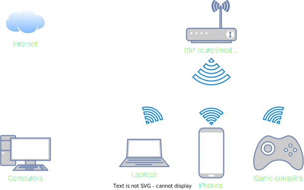
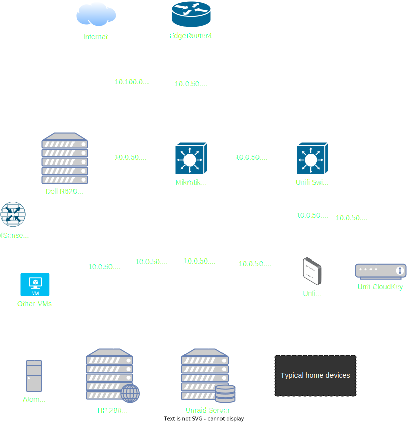

The goal of this page isn't to explain everything about networking, rather it's talking about some high-level ideas and how your homelab fits into the equation.

## Typical home network

The diagram below shows a pretty typical home network setup, plus or minus some devices:

Some details being:

- The gateway for your network is the ISP-provided router/modem, usually also with wireless capabilities.
- A few devices may be physically connected to the router/modem with ethernet cable.
    - Desktop computers
- Most devices connect wirelessly
    - Laptops
    - Phones
    - Tablets
    - Printers
    - Game consoles
    - IoT/"smart" devices
- The network is comprised of a single private IP address space
    - Most commonly a `192.168.0.x/24` or `192.168.1.x/24` network

Adding your homelab device(s) would be as simple as plugging them into the router or connecting them wirelessly. Maybe even purchasing a basic network switch to increase the amount of devices you can plug in.

There's nothing inherently wrong with the network setup, it will work fine for just about everyone. That being said, as your homelab grows there may be some configuration you want/need to do, which can be difficult or impossible depending on what router you have.

## Basic upgrades

There's a couple places that can be upgraded to greatly increase your capacity/capabilities. As a general rule of thumb, the below recommendations are focused on equipment that are tier(s) above your typical consumer devices.

Another note, I swear I'm not sponsored by Ubiquiti but their products do a really good job of filling certain roles and their Unifi ecosystem makes management a breeze. 

### Router

If you find your current router lacking the things you need, there's some good options to replace it. A quick list of ideas:

- Mikrotik
    - Some of [these](https://mikrotik.com/products/group/wireless-for-home-and-office) are the closest drop-in replacements for something an ISP provides
    - [These](https://mikrotik.com/products/group/ethernet-routers) are a little beefier, but lack the wireless functionality
- Ubiquiti [EdgeRouters](https://store.ui.com/us/en?category=wired-edge-max-routing)
- Ubiquiti [Unfi Gateways](https://store.ui.com/us/en?category=all-unifi-cloud-gateways)
- [pfSense](https://www.pfsense.org/) / [OPNsense](https://opnsense.org/)
    - There's small devices designed to run these OS's that can be purchased on Amazon, etc.
    - Can also build a computer for this
    - Some people run this as a VM, but I feel like there's some sketchiness there so wouldn't recommend it
- Probably others

### Switch

Having a decent managed switch is a game changer for homelab things, so much room for activities! A couple solid options to wet your whistle:

- Netgear managed switches
    - Some solid options at usually a budget price, may lack some features
    - Typically Layer 2
- [Mikrotik](https://mikrotik.com/products/group/switches)
    - These usually have a great value factor for what they provide
    - A lot of models have the ability to run as either Layer 2 or Layer 3 devices
- Ubiquiti [Unifi Switches](https://store.ui.com/us/en?category=all-switching)

### Access points

As you start upgrading the rest of your network, you'll likely discover that you need new/additional access points. Or maybe you just want more range/speed/capacity/configurability/etc, either way! 

- [TP-Link Omada](https://www.tp-link.com/us/business-networking/omada/wifi)
- [EnGenius](https://www.engeniustech.com)
- [Ruckus](https://www.ruckusnetworks.com/products/wireless-access-points/)
- Mikrotik
    - Some APs [here](https://mikrotik.com/products/group/wireless-for-home-and-office)
    - [More](https://mikrotik.com/products/group/wireless-systems) wireless stuff
- Ubiquiti [Unifi APs](https://store.ui.com/us/en?category=all-wifi)

## More complex network

Once you obtain some more "advanced" network hardware you'll have lot more ways to organize things and your network diagram will start looking more complex.

For example, here's what my network looked like at one point:

There may be a lot of devices and arrows and whatnot, but was really just a [typical home network](#typical-home-network) with a couple extra devices added.

Here's some notes to go with the picture:

### Top level

- The EdgeRouter4 was the main router for the network
    - Ingress/egress for everything
    - This provided DHCP for the "home" network of `10.0.50.x/24`
    - There was also a `10.100.0.x/30` network between this router and the Dell R620
        - More on this later

### Middle level (networking devices)

- Next in line was the Mikrotik 24-port switch as the main "core" of the network
- Following that, there was a Unifi 8-port PoE switch connected to the Mikrotik
    - This had the Unifi AP and CloudKey (to manage Unifi devices) since they require PoE

### Middle level (user devices)

- The normal home devices hung off the Mikrotik in the `10.0.50.x/24` network, with some additional friends:
    - Unraid server
        - This provided network storage as well as hosted a library of media for the Plex server
    - Plex server
        - This had a mount for the media library from Unraid
        - Shoutout the HP 290 for cheap hardware transcoding
    - Atomic Pi
        - This was an annoying little device that ran Pi-hole for secure DNS as well as network-wide adblocking

### Homelab stuff

Things get a little funky here so bear with me

- The Dell R620 was a Proxmox virtualization server. It was connected to multiple networks:
    - The "management" port to the `10.0.50.x/24` network
        - This provided access to the web UI from my desktop computer
    - Another port to the `10.100.0.x/30` network
        - This was a direct connection to the EdgeRouter to be used by the VMs
    - Another port to the `10.0.50.x/24` network
        - This was to allow the potential creation of VMs that lived in the home network
        - Not drawn on the diagram since it wasn't used all that often and it would clutter the already crowded space

- On Proxmox, I created a pfSense VM that had two adapters:
    - A WAN port bridged to the adapter attached to the `10.100.0.x/30` network
        - This was for ingress/egress traffic between lab VMs and the internet, via pfSense
    - A LAN port as a virtual bridge (not connected to any physical adapters)
        - This provided a mechanism to attach any created VMs to the pfSense VM's LAN port

There was also some firewall configuration on the EdgeRouter and pfSense to block anything lab-related from touching my "home" network.

All of this let me spin up VMs, download/install things, play around, etc. without worrying about any potential issues spilling across networks. As mentioned, it was also possible to create VMs and attach them to my home network via that third port on Proxmox.

I would be foolish to think that there isn't a better way I could have laid all this out. However the experience of setting it all up, troubleshooting it, and playing with it taught me a lot!

Speaking of, [here's](https://www.reddit.com/r/homelab/search/?q=network+diagram&type=link&sort=top&iId=4bf08e3b-4d71-4138-a8ce-a52935b8d830) some inspiration for network digrams/layouts.

## "We need to go deeper"

All of the recommendations for networking gear above have been pretty tame. That being said, there's still another level that you can reach and that's with our returning guest: used enterprise gear!

### Enterprise gear

Similar to the [Hardware - Going Crazy](  ) section, there's a whole world out there of powerful, loud, and feature-packed networking hardware that can be obtained. Take similar caution about the noise/heat/power considerations, but there's not much you can't do with these things.

- Brocade switches
    - ICX 6610, ICX 7250 can be commonly found for a decent price
        - Might be newer/other options, I haven't looked in a while
    - [Here's](https://forums.servethehome.com/index.php?threads/brocade-icx-series-cheap-powerful-10gbe-40gbe-switching.21107/) one good ServeTheHome thread, there's a bunch

- Cisco gear
    - There's a huge secondary market for this stuff
    - I'm not experienced with anything Cisco so definitely do some research

- 10GB networking
    - This is technically feasibly with some prosumer devices, but enterprise gear is much more suited for it and can be obtained cheaper