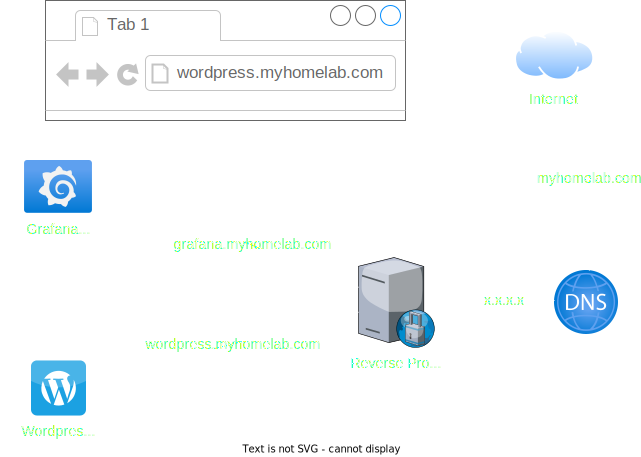

This page is all about accessing things securely. For example, you may have a service running in your homelab that you'd like to access from your phone while you're out and about. There's a whole bunch of different ways to accomplish this, some sketchier than others, but I'll cover some of the more secure options here.


Some of the options mentioned below rely on functioning DNS and/or TLS certificates. I highly recommend checking out my post on [Domains and Certificates](  ) for background information.



Some of the options that will be discussed require connectivity from outside the network. One of the quickest ways to do this is simply opening the required ports on your firewall and pointing them to the relevant services.

It is important to note that this is ***allowing traffic from the internet*** through your router. Let that sink in and evaluate if that is a risk you're willing to accept; I would recommend against it wherever possible.


Alright, notes and warnings aside let's get into it.

## The Situation

For each section below, we'll use the same example setup to keep things consistent.

Let's say you have:
- A Wordpress site, available on port 80
- A Grafana instance, available on port 3000
- Both services are running on the same host (I'll refer to as service host)

Accessing these services requires remembering the IP address of the service host and the port of the desired service, e.g. accessing Grafana via `http://192.168.0.10:3000`. Maybe you created a DNS entry locally that defines this so you can instead access it via `http://grafana.some.local.domain` which is a little easier.

That's all and great, except for a couple cases:
- The IP address of the service host changes
- New services are added, increasing the complexity
- The services are split across multiple service hosts

You've recognized some of this shortcomings, read my post about domains, and purchased the `myhomelab.com` domain.

## Tailscale

To start things off, let's talk about [Tailscale](https://tailscale.com/). This is a managed VPN service, in that they operate servers to make things work. The service itself is free to use however, with generous limits.

Since it's really just a VPN, here's how to get it setup:
- Create a Tailscale account
- Install Tailscale on the service host and a client device (computer, phone, etc.)
  - Ensure you start it, sign in, and all that good stuff
- Verify you can see your devices in the Tailscale admin console

From here, you should be able to access the service host from your client device via the Tailscale IP address. This is great because now you have a secure tunnel to access your things no matter where you are, as long as you (and the service host) have internet access!

There's lots of additional configuration you can do so I recommend looking around the admin console and reading through the docs. For example, you can invite others to your tailnet to have access to the services, or just share an individual device.

### Pros and Cons

#### Pros

- Simple to deploy, "It just works" factor
- Ability to limit access via ACLs
- Based on [WireGuard](https://www.wireguard.com/)

#### Cons

- No real way to "share with the world"
  - Have to invite people to your tailnet or send share links
  - They have [Funnel](https://tailscale.com/kb/1223/funnel), but that requires a paid plan
- Reliance on their servers
  - There are projects out there to host your own, but that's one more thing to manage
- Free tier limits
  - 3 users
  - 100 devices

## Reverse Proxy

Next up is reverse proxies. These sit (logically) in front of your desired services and make them available as either subdomains or subfolders of a given domain.

Here's an example configuration:
- A DNS record points `myhomelab.com` to the device running the reverse proxy
- The reverse proxy is configured with the various services on subdomains:
  - Wordpress is `wordpress.myhomelab.com` at `192.168.0.10:80`
  - Grafana is `grafana.myhomelab.com` at `192.168.0.10:3000`
- The reverse proxy listens on port 80 (HTTP) and 443 (HTTPS) for requests

Which results in the following flow:
- Navigating to `wordpress.myhomelab.com` hits the reverse proxy
- The `wordpress` subdomain is valid and points to the wordpress service
- The request is routed through the reverse proxy to wordpress

An illustration of what I just described:

The above example was using subdomains, however it's also possible to use subfolders instead which would look like:
- `myhomelab.com/wordpress`
- `myhomelab.com/grafana`

In my opinion, the subdomain option is a little cleaner and potentially easier to do more complicated things with. Nested subdomains anyone?

### Options

There's a lot of reverse proxies out there, but the most popular ones I've seen are:
- [nginx](https://nginx.org/en/)
  - [Nginx Proxy Manager](https://nginxproxymanager.com/)
  - [SWAG](https://docs.linuxserver.io/general/swag/)
- [Traefik](https://traefik.io/)
- [Caddy](https://caddyserver.com/)

Each of these will in the end accomplish the same goal, it's just how you get there. Some may have extra features, easier configuration, high-availability, etc. so I recommend looking around and seeing what fits your use case best.

### Pros and Cons

#### Pros

- Performance, reverse proxies are purpose-built for this job
- Only need to expose ports 80/443 to access all configured services
- Options for authentication
  - Basic HTTP auth, authentication middleware, etc.
- Some of the options are super simple to configure
  - Nginx Proxy Manager
  - SWAG
  - Caddy

#### Cons

- Need to expose 80/443 to the internet somewhere
- Some of the options are more complex to configure
  - Plain nginx
  - Traefik claims to be easy but I've run into issues

## Cloudflare Tunnel

Lastly, [Cloudflare Tunnel](https://developers.cloudflare.com/cloudflare-one/connections/connect-networks/), which in my mind sit between the Tailscale and reverse proxy options. This can be envisioned as a sort of "reverse-VPN", in that their binary `cloudflared` connects from a device to the Cloudflare network, negating the need to expose any ports.

Here's how it could be configured for the example setup:
- Create an account on Cloudflare and have them manage a domain you own
- Install + configure `cloudflared` on the service host
- Do whatever configuration is needed within the Cloudflare dashboard

Once that's done the services should be accessible from wherever you configured them to be reachable at (subdomain/subfolder).

Since Cloudflare has a very generous free offering of services, there's a ton of additional things that can be configured within their dashboard that enhances this option even more. Also, their tunnels aren't limited to just web traffic! You can do other things like SSH tunnels, RDP sessions, etc.

### Pros and Cons

#### Pros

- Easy to configure and not much to manage
- Security
  - No open ports
  - Secure tunnel
  - Access controls
- Speed
  - Leverages their massive CDN and infrastructure
- Part of the Cloudflare ecosystem
  - Lots of products and services available

#### Cons

- Reliance on Cloudflare
  - Some people have issues with having their traffic route through Cloudflare

## Combination

The last thing I'll mention is that the best choice for you may be combination of some/all of the previously mentioned options. Some examples:

**Reverse proxy + Tailscale:**
- Services run locally
- Reverse proxy in the cloud to provide access from the internet
- Tailscale connects reverse proxy to services
- Direct personal connectivity to services via Tailscale

**Cloudflare Tunnel + Tailscale**
- Services run somewhere, local or cloud
- Cloudflare Tunnel to provide access from the internet
- Direct personal connectivity to services via Tailscale

Plus whatever other combinations you can think of, so definitely experiment to see what works best for you in your homelab endeavors!
