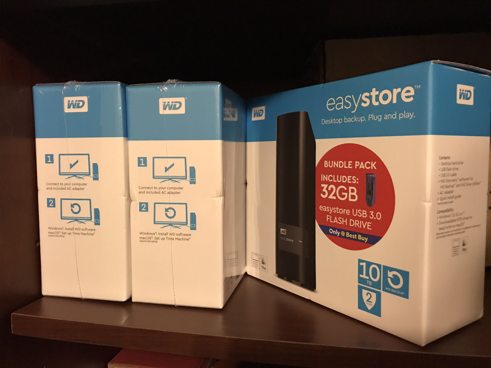
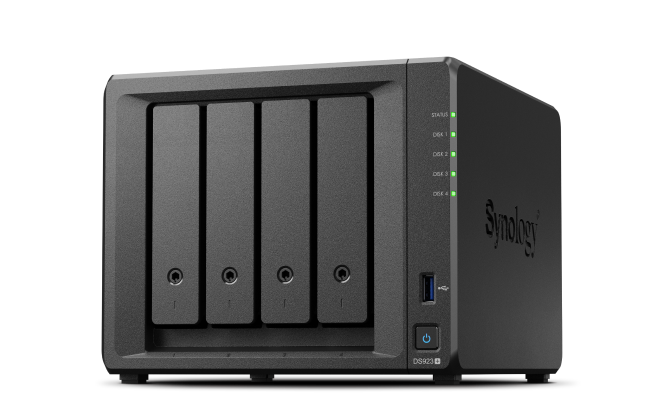
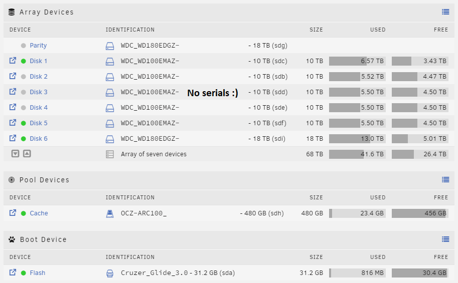

This page will talk about various storage options for your homelab, starting simple and building from there.

## Bare bones

At this level, you're really just using whatever storage is available on your compute hardware, maybe adding another disk to it, etc.

This will work fine in the beginning, but as you grow you're likely going to want more capacity/availability/redundancy/etc.

### Pros

- Little to no extra financial investment
- "It just works"

### Cons

- Potentially limited capacity, depending on the device
- Lack of availability
    - The data is only available on this host
- Lack of redundancy
    - Who's RAID?

## External hard drive(s)

So you decided one or more of the following:

- You wanted to be able to migrate your data between hosts
- You needed more space and the device you're using doesn't have room (shoutout MFF/Tiny devices)

One or more external hard drives could certainly bolster your storage capabilities. These will function quite similarly to the [Bare-bones](#bare-bones) option; just plug it in, format it, and you're off to the races.

These also give you the flexibility of easily being able to unplug it and move the data to another host.

Some routers have a USB port which allows you to plug in an external hard drive and share it on your network. This may kind of work, but I wouldn't recommend it for any extended period of time. 

### Pros

- Greatly increased capacity
- Plug and go
    - Also, unplug and go
- Usually great cost per GB ($/GB) compared to buying a standard "internal" hard drive

### Cons

- Some devices only have so many USB ports
- Managing hard drives dangling off of your device
- Lack of availability
    - The data is only available on the host the hard drive is plugged into
- Lack of redundancy
    - What's a ZFS?

## Off-the-shelf NAS

There's multiple companies out there that sell 1-8 bay devices that plug into your network, which are kind of an evolution to the [External hard drive(s)](#external-hard-drives) option.

There's some sort of firmware/OS on them, with varying amounts of customizability, that lets you easily make storage available to other network devices.

Some options are:

- Synology
- QNAP
- Western Digital
- Probably lots of others

### Pros

- More overall capacity than a single external hard drive
- Availability
    - Usually quite simple to share out on your network
    - Not tied to a specific device (laptop, computer, etc.)
        - e.g. Turning off your desktop doesn't affect the NAS
- Potential redundancy
    - Depends on firmware/OS and/or number of bays
    - May be able to configure raid

### Cons

- Kind of expensive for what they are
- Limited number of bays
    - If you outgrow it, you need to buy another
- Potential lack of redundancy
    - RAID depends on firmware/OS and/or number of bays
- Underpowered
    - These devices typically run very anemic processors
- Limited connectivity
    - From what I've seen there's usually just a USB and 1G ethernet port
    - If you've got a busy network, a lot of users, or frequently transfer very large files, 1G networking may be a limiting factor

## Custom NAS

At this point, we're approaching the cream of the crop when it comes to storage. This option is typically a custom-built server (see [Building PCs](  )) running a dedicated "NAS operating system".

There's a **lot** of variables to consider when selecting hardware for a dedicated NAS so I recommend going for a long walk on the internet before making any decisions.

Two of the most popular NAS operating systems I've seen are:
- [Unraid](https://unraid.net/)
- [TrueNAS](https://www.truenas.com/)

I don't personally have much experience with TrueNAS but I've read and seen a bunch of good things about it. I plan to build out a TrueNAS machine for "important things storage" at some point so I'll provide more info when I have it. Again, go for an internet walk.

I do however have quite a bit of experience with Unraid, and will provide information below in a [dedicated section](#unraid).

### Pros

- You built it, you know it
- Expandable
    - The chassis is really the limiting factor for the maximum number of drives
- Performance
    - These will kick the pants off of any of the above options
- Redundancy
    - Depending on your risk tolerance level, you can go as much or as little into RAID/ZFS/etc. as you see fit

### Cons

- Expensive
    - Depending on your requirements, the hardware can quickly become quite costly
    - More bays = more hard drives = less wallet
- Maintenance?
    - This now becomes another device you need to keep up to date, etc.
- Rabbit hole
    - Now that you have this behemoth, what if you want backups as well?
        - Time to build another
    - Offsite backups too?
        - Time to build another

## Unraid

The cover picture is my current Unraid server, built in ~2019 out of a previous gaming computer's parts.

It's specs are:

- Case: Rosewill RSV R4000U
- CPU: i7-4790k
- RAM: 16GB DDR3 2400Mhz
- Motherboard: Asus Maximus VI Formula
- Cache drive: OCZ Arc 480GB SSD
- Array (68TB usable):
    - Parity: 1x 18TB WD Easystore (WDC_WD180EDGZ)
    - Data:
        - 5x 10TB WD Easystore (WDC_WD100EMAZ)
        - 1x 18TB WD Easystore (WDC_WD180EDGZ)
- OS drive: 32GB SanDisk flash drive

Now that the introductions are out of the way, let's get into the deets.

### What is it?

I recommend reading the [official docs](https://docs.unraid.net/unraid-os/overview/what-is-unraid/) as they explain things far better than I ever could.

The tl;dr:
- The OS loads from a flash drive and runs in-memory
- Disk configuration:
    - One (or more) parity drives
        - Typically start with one, add more as the array grows
    - One (or more) data drives
        - Where all the stuff gets stored
- Files are stored "as-is" on a given data drive
    - No striping across multiple drives
    - Unplug a drive and access the files that are on it
- Parity is calculated and checked on a regular schedule, providing some level of protection for the data
    - Not as resilient as typical RAID/ZFS implementations
    - Better than nothing
- Typical NFS/SMB/etc. network shares
- Can run VMs and/or Docker containers

### Why is it cool?

There's a lot of good things going for Unraid, some of which are:

- Ability to add arbitarily sized drives to the system over time makes expanding super easy
    - RAID/ZFS setups typically require adding multiple drives (another vdev, etc.) any time you want to grow
- Simple network shares
    - All of the common network share protocols are available
    - Easy to mount shares to other devices
    - User management, public/private, etc.
    - I personally use this for my Plex server (separate machine), it has the library of media mounted from the Unraid server
- VMs
    - Create VMs for whatever you need them for, with support for hardware passthrough
    - Persist data with shares exported from Unraid
- Docker
    - Run all sorts of things
    - I personally run a stack of containers all related to supporting Plex
        - Once I migrate Plex back into a container on Unraid, all the things will be contained in a single box
- Probably more things but I'm tired